 
  

    <!-- profile logo 个人资料徽标 -->
    
      <!-- visitor statistics logo 访客数统计徽标 -->
    
  

   

  <!-- dynamic typing effect 动态打字效果 -->
  <!--  -->
  
   

  

    
    &emsp;&emsp;
    
  

   

  <!-- Snake Code Contribution Map 贪吃蛇代码贡献图 -->
  <picture>
    <source media="(prefers-color-scheme: dark)" srcset="https://cdn.jsdelivr.net/gh/ArcherTrister/ArcherTrister/profile-snake-contrib/github-contribution-grid-snake-dark.svg" />
    <source media="(prefers-color-scheme: light)" srcset="https://cdn.jsdelivr.net/gh/ArcherTrister/ArcherTrister/profile-snake-contrib/github-contribution-grid-snake.svg" />
    
  </picture>

  <!-- GitHub Star link -->
<!-- <h2 align="center">⚡&emsp;&emsp;⚡</h2> -->
<h2 align="center">
  
</h2>
 

  

    
    
  

<!-- # 🌱Social

    

 -->

<!-- wakatime 统计 -->

         

<!-- GitHub 奖杯🏆 -->

 

  

    
  

   

<!-- GitHub 数据统计 -->
<!-- 
   -->

  
 

<!--  -->

  <!-- profile-3d-contrib 3D贡献图-->
<!-- 
  -->

<h2 align="center">🔥 Languages & Frameworks & Tools & Abilities 🔥</h2>
 
<!-- just img 图片 -->

  <h3>👨‍💻 Programming and Markup Languages</h3>

  

      
      
      
      
      
      
      
      
      
      
      
      
      
      
      
      
      
      
      
      
      
      
      
  

  <h3>🧰 Frameworks and Libraries</h3>

  

      
      
      
      
      
      
      
      
      
      
      
      
      
      
      
      
      
      
      
      
      
      
      
      
      
  

  <h3>🗄️ Databases and Cloud Hosting</h3>

  

      
      
      
      
      
      
      
      
      
      
      
  

  <h3>💻 Software and Tools</h3>

  

      
      
      
      
      
      
      
      
      
      
      
      
      
      
      
      
      
      
      
      
      
      

  

<!-- # 🔭Actions

    

	

<picture>
  <source media="(prefers-color-scheme: dark)" srcset="https://raw.githubusercontent.com/ArcherTrister/ArcherTrister/output/github-contribution-grid-snake-dark.svg">
  <source media="(prefers-color-scheme: light)" srcset="https://raw.githubusercontent.com/ArcherTrister/ArcherTrister/output/github-contribution-grid-snake.svg">
  
</picture> -->

### 📊 WakaTime

```mermaid
mindmap
  root((ArcherTrister))
    编程
      Web开发
      网络爬虫
      人工智能
    摄影
      人文
      建筑
      风景
    旅行
      成都
      桂林
      北海
      百色
      昆明
      大理
    阅读
      人物传记
      个人成长
      社会文化
      心理
      计算机技术
```

<!-- ########################################## 分割 ########################################## -->

<!-- ########################################## 分割 ########################################## -->

<!-- Github-Stats-Terminal 终端风格信息 -->

<!--   -->

<!-- Quotes 名人名言 -->

 

<!-- Joke 笑话 -->

   

<!-- Awesome repo 比较好的仓库-->
<!-- 
   -->

<!-- Wakatime Graph-->
<!-- <table>
  <tr>
    <td></td>
    <td></td>
  </tr>
  <tr>
    <td colspan="2"> </td>
  </tr>
</table> -->

<!-- ########################################## 分割 ########################################## -->

<!-- just img 图片 -->

<!-- run 图片 -->

<!-- Joke 笑话 -->
<!-- 

 -->

<!-- github-readme-streak-stats 连续提交代码天数记录 -->

<!-- &emsp;

&emsp; -->

<!-- Spotify 音乐 -->
<!-- &emsp;&emsp;&emsp;&emsp;

  &emsp;&emsp;&emsp;&emsp; -->

<!-- metrics 基础资料 -->

&emsp;

<!--  -->

<!-- &emsp; -->

<!-- My Blog 博客首页 -->

&emsp;

<!--  -->

<!-- &emsp; -->

<!-- GitHub Activity Graph GitHub 活动图 -->
<!-- <table align="center">
  <tr>
    <td></td>
  </tr>
</table> -->

<!-- ########################################## 分割 ########################################## -->

<!-- GitHub metrics 信息指标 -->

<!-- just img 图片 -->

<!-- first form 第一个表格 -->
<!-- <table>
  <tr>
    <td></td>
  </tr>
</table> -->

<!-- second form 第二个表格 -->
<!-- <table>
  <tr>
    <td></td>
    <td></td>
  </tr>
  <tr>
    <td></td>
    <td></td>
  </tr>
  <tr>
    <td></td>
    <td></td>
  </tr>
  <tr>
    <td></td>
    <td></td>
  </tr>
  <tr>
    <td></td>
    <td></td>
  </tr>
  <tr>
    <td></td>
    <td></td>
  </tr>
  <tr>
    <td></td>
    <td></td>
  </tr>
</table> -->

<!--  -->

<!-- just img 图片 -->
<!--  -->

